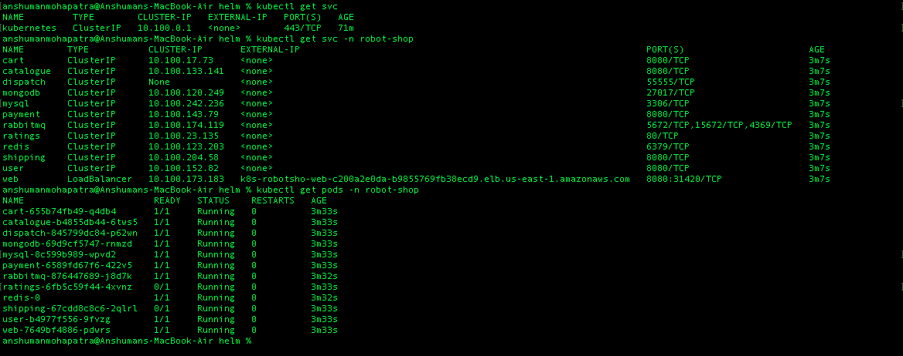

# E-Commerce Three-Tier Application Deployment on AWS EKS

## Overview
This document showcases the successful deployment of a microservices-based E-Commerce Three-Tier application (Stan's Robot Shop) on Amazon EKS (Elastic Kubernetes Service). The deployment follows best practices for cloud-native applications, leveraging AWS managed services, Helm, and Kubernetes resources.

---

## Table of Contents
- [Prerequisites](#prerequisites)
- [Cluster Setup](#cluster-setup)
- [IAM OIDC Provider Configuration](#iam-oidc-provider-configuration)
- [AWS ALB Controller Setup](#aws-alb-controller-setup)
- [EBS CSI Driver Setup](#ebs-csi-driver-setup)
- [Application Deployment](#application-deployment)
- [Ingress Configuration](#ingress-configuration)
- [Microservices Deployed](#microservices-deployed)
- [Proof of Work](#proof-of-work)
- [References](#references)

---

## Prerequisites
- **kubectl**: Kubernetes CLI ([Install Guide](https://docs.aws.amazon.com/eks/latest/userguide/install-kubectl.html))
- **eksctl**: EKS management CLI ([Install Guide](https://docs.aws.amazon.com/eks/latest/userguide/eksctl.html))
- **AWS CLI**: AWS Command Line Interface ([Install Guide](https://docs.aws.amazon.com/cli/latest/userguide/cli-chap-install.html))
- AWS CLI configured ([Quickstart](https://docs.aws.amazon.com/cli/latest/userguide/cli-configure-quickstart.html#cli-configure-quickstart-config))

---

## Cluster Setup
- Created an EKS cluster using `eksctl`:
  ```sh
  eksctl create cluster --name demo-cluster-three-tier-1 --region us-east-1
  ```

---

## IAM OIDC Provider Configuration
- Configured IAM OIDC provider for the cluster:
  ```sh
  export cluster_name=<CLUSTER-NAME>
  oidc_id=$(aws eks describe-cluster --name $cluster_name --query "cluster.identity.oidc.issuer" --output text | cut -d '/' -f 5)
  aws iam list-open-id-connect-providers | grep $oidc_id | cut -d "/" -f4
  # If not present:
  eksctl utils associate-iam-oidc-provider --cluster $cluster_name --approve
  ```

---

## AWS ALB Controller Setup
- Downloaded and created IAM policy for ALB controller
- Created IAM role and service account for the controller
- Deployed AWS Load Balancer Controller using Helm:
  ```sh
  helm repo add eks https://aws.github.io/eks-charts
  helm repo update eks
  helm install aws-load-balancer-controller eks/aws-load-balancer-controller \  
    -n kube-system \
    --set clusterName=<your-cluster-name> \
    --set serviceAccount.create=false \
    --set serviceAccount.name=aws-load-balancer-controller \
    --set region=<region> \
    --set vpcId=<your-vpc-id>
  # Verified deployment:
  kubectl get deployment -n kube-system aws-load-balancer-controller
  ```

---

## EBS CSI Driver Setup
- Created IAM role and attached AWS managed policy for EBS CSI driver
- Deployed the EBS CSI driver addon:
  ```sh
  eksctl create iamserviceaccount \
    --name ebs-csi-controller-sa \
    --namespace kube-system \
    --cluster <YOUR-CLUSTER-NAME> \
    --role-name AmazonEKS_EBS_CSI_DriverRole \
    --role-only \
    --attach-policy-arn arn:aws:iam::aws:policy/service-role/AmazonEBSCSIDriverPolicy \
    --approve
  eksctl create addon --name aws-ebs-csi-driver --cluster <YOUR-CLUSTER-NAME> --service-account-role-arn arn:aws:iam::<AWS-ACCOUNT-ID>:role/AmazonEKS_EBS_CSI_DriverRole --force
  ```

---

## Application Deployment
- Used the provided Helm chart to deploy the Robot Shop application:
  - Chart: [`three-tier-architecture-demo/EKS/helm/Chart.yaml`](three-tier-architecture-demo/EKS/helm/Chart.yaml)
  - Values: [`three-tier-architecture-demo/EKS/helm/values.yaml`](three-tier-architecture-demo/EKS/helm/values.yaml)
  - Templates: [`three-tier-architecture-demo/EKS/helm/templates/`](three-tier-architecture-demo/EKS/helm/templates/)
- Example Helm install command:
  ```sh
  kubectl create ns robot-shop
  helm install robot-shop --namespace robot-shop ./three-tier-architecture-demo/EKS/helm
  ```

---

## Ingress Configuration
- Applied the ALB Ingress resource:
  - [`three-tier-architecture-demo/EKS/helm/ingress.yaml`](three-tier-architecture-demo/EKS/helm/ingress.yaml)
- This exposes the web frontend via AWS ALB.

---

## Microservices Deployed
The following microservices were deployed as part of the application:
- **Frontend**: web
- **User Services**: user, ratings
- **Product Services**: catalogue, cart
- **Order/Shipping**: shipping, dispatch
- **Payments**: payment
- **Databases**: mongodb, mysql, redis
- **Messaging**: rabbitmq

Each service is defined as a Kubernetes Deployment and Service in the Helm chart.

---

## Proof of Work
Below are screenshots as evidence of the successful deployment and running state of the application:

### 1. Application Up & Running


### 2. Pods and Services Running


---

## References
- [three-tier-architecture-demo/EKS/01-prerequisites.md](three-tier-architecture-demo/EKS/01-prerequisites.md)
- [three-tier-architecture-demo/EKS/02-eks-cluster-setup.md](three-tier-architecture-demo/EKS/02-eks-cluster-setup.md)
- [three-tier-architecture-demo/EKS/03-oidc-IAM.md](three-tier-architecture-demo/EKS/03-oidc-IAM.md)
- [three-tier-architecture-demo/EKS/04-alb-configuration.md](three-tier-architecture-demo/EKS/04-alb-configuration.md)
- [three-tier-architecture-demo/EKS/05-ebs-csi-driver.md](three-tier-architecture-demo/EKS/05-ebs-csi-driver.md)
- [three-tier-architecture-demo/EKS/helm/README.md](three-tier-architecture-demo/EKS/helm/README.md)

---

**This document serves as a comprehensive showcase of deploying a production-grade, microservices-based E-Commerce application on AWS EKS using Kubernetes best practices.** 